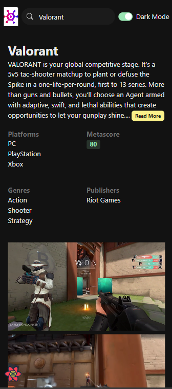

# Game Library

Welcome to **Game Library**, a look-alike project inspired by [RAWG.io](https://rawg.io/). This project is a comprehensive web application that allows users to explore, discover, and manage a personalized library of video games. The Game Library platform is built to provide users with detailed information on various games, including genres, platforms, and more.

## Features

- **Game Search & Discovery**: Easily search for games by title, genre, or platform.
- **Detailed Game Information**: View comprehensive details about each game, including descriptions, ratings, release dates, and more.
- **Responsive Design**: Optimized for various devices, ensuring a seamless experience across desktops, tablets, and mobile phones.
- **API Integration**: Utilizes external APIs to fetch up-to-date game data and information.

## Tech Stack

- **Frontend**: React.js
- **Backend**: Node.js, Express.js
- **Database**: MongoDB
- **APIs**: Integrated with the [RAWG Video Games Database API](https://rawg.io/apidocs)
- **Styling**: Tailwind CSS
- **Deployment**: Deployed on Google Cloud Platform (GCP) using Cloud Run

## Getting Started

### Prerequisites

Ensure you have the following installed on your local development environment:

- Node.js
- npm or yarn
- MongoDB

### Installation

1. **Clone the repository:**

   ```bash
   git clone https://github.com/yash-bitla/game-library.git
   cd game-library
   ```

2. Install dependencies:

   ```bash
   npm install
   # or
   yarn install
   ```

3. Set up environment variables:

   Create a .env file in the root directory and add your configuration:

   ```
   MONGODB_URI=your_mongodb_connection_string
   RAWG_API_KEY=your_rawg_api_key
   PORT=5000
   ```

4. Start the application:
   ````bash
   npm start
   # or
   yarn start
   ```
   ````

The app will be running on http://localhost:5000.

## Usage

- **Search Games**: Use the search bar on the homepage to find games by title, genre, or platform.
- **View Game Details**: Click on any game to see its detailed information.
- **Manage Library**: _This feature is planned for future development_. Soon, users will be able to add or remove games from their personalized library using MongoDB for data storage.

## Future Scope

- **Personalized Game Library**: Implementing functionality that allows users to manage their own game library, adding and removing games as they wish. This feature will leverage MongoDB for database management and is currently under development.

## Screenshots

<div align="center">
  
  <p><b>Figure 1:</b> Game Search & Discovery (Dark Mode)</p>
</div>

<div align="center">
  
  <p><b>Figure 2:</b> Game Search & Discovery (Light Mode)</p>
</div>

<div align="center">
  
  <p><b>Figure 3:</b> Detailed Game Information</p>
</div>

<div align="center">
  
  <p><b>Figure 4:</b> Search Game</p>
</div>

<table align="center">
  <tr>
    <td>
      
    </td>
    <td>
      
    </td>
  </tr>
</table>
<p align="center"><b>Figure 2:</b> Mobile Version</p>

## Contributing

Contributions are welcome! If you'd like to contribute to the project, please fork the repository and use a feature branch. Pull requests are warmly welcome.

1. **Fork the project**
2. **Create your feature branch**: `git checkout -b feature/YourFeature`
3. **Commit your changes**: `git commit -m 'Add some feature'`
4. **Push to the branch**: `git push origin feature/YourFeature`
5. **Open a pull request**

## Acknowledgments

- Inspired by the [RAWG.io](https://rawg.io/) platform.
- Thanks to [RAWG Video Games Database API](https://rawg.io/apidocs) for providing the data.
